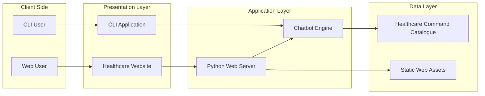
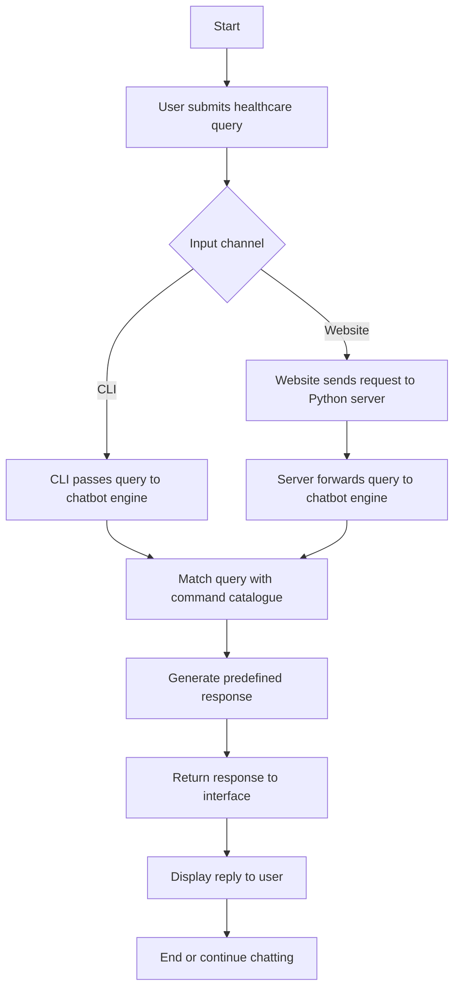
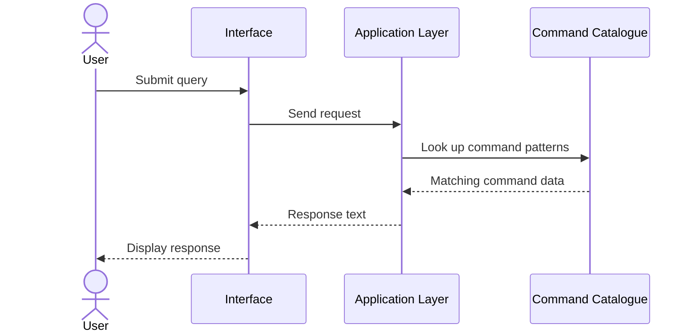
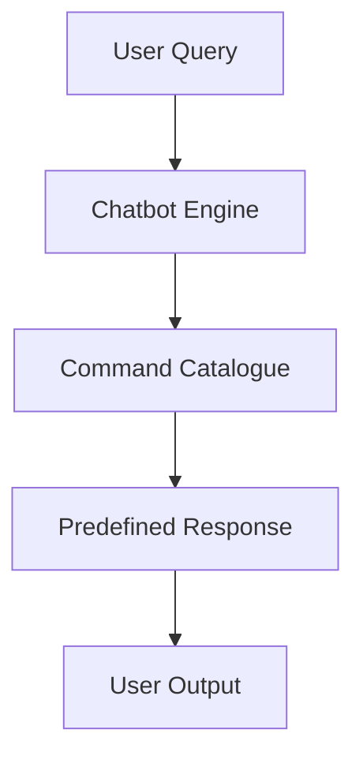
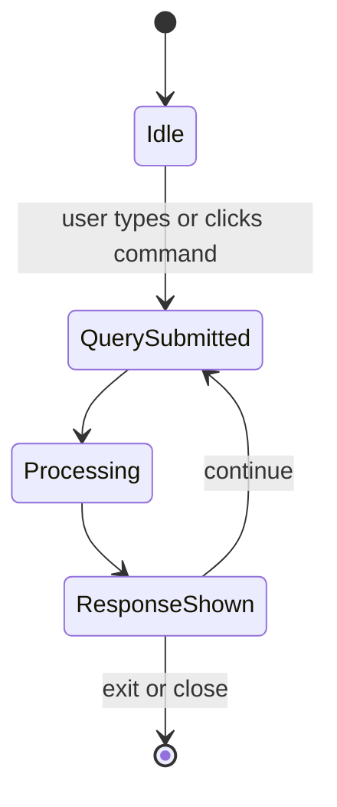

# High Level Design
## Project: Design and Development of Natural Language Interface for Healthcare Infrastructure

## 1. Introduction

### 1.1. Scope of the document

This High Level Design document describes the overall architecture, major modules, top-level data flow, interfaces, and non-functional requirements of the Healthcare Chatbot project.

The system in scope includes:

- A Python command-line chatbot
- A dark-themed healthcare website
- A floating chatbot button on the right side of the screen
- A lightweight Python web server
- Basic natural language handling through string matching
- Predefined healthcare information responses

The following are outside the current scope:

- Real hospital management system integration
- Patient record management
- Database-backed storage
- User authentication and authorization
- Real-time IoT or medical device connectivity

### 1.2. Intended Audience

This document is intended for:

- Faculty reviewers
- Project evaluators
- Developers extending the project
- Testers validating the solution
- Students preparing presentation or viva explanations

### 1.3. System overview

The Healthcare Chatbot is a lightweight natural language interface for healthcare infrastructure information. It accepts user requests through either a command-line interface or a website chatbot and returns predefined responses related to hospital services such as emergency support, appointments, bed availability, ICU status, billing, insurance, pharmacy, lab tests, and visiting hours.

The system follows a layered approach:

- Presentation Layer: CLI and website
- Application Layer: Python server and chatbot engine
- Data Layer: in-memory command catalogue and static assets

The main design goal is to provide a simple, low-cost, easy-to-understand chatbot system using basic string matching rather than advanced NLP or machine learning.

## 2. System Design

### 2.1. Application Design

At a high level, the application consists of:

- A CLI channel for local terminal interaction
- A web channel for browser-based interaction
- A shared chatbot engine to avoid duplication
- An HTTP layer to serve the website and chatbot APIs

The major architectural principle is reuse of the same business logic across different interfaces.

### High Level Architecture Diagram

### 2.2. Process Flow

The overall process flow is:

1. The user enters a healthcare query through CLI or website.
2. The query is forwarded to the chatbot engine.
3. The chatbot engine matches the query with predefined commands.
4. A suitable response is generated.
5. The response is sent back to the user interface.

### High Level Process Flow Diagram

### 2.3. Information Flow

At a high level, information moves in the following direction:

- User input is captured by the interface
- Interface passes the query to processing logic
- Processing logic reads the command catalogue
- Response is returned to the interface
- Interface displays output

There is no persistent backend conversation store in the current version.

### High Level Information Flow Diagram

### 2.4. Components Design

| Component | Purpose | Description |
|---|---|---|
| CLI Interface | Terminal interaction | Allows the user to enter queries and receive text replies |
| Web Interface | Browser interaction | Displays website and floating chatbot with clickable commands |
| Web Server | Request handling | Serves web assets and chatbot endpoints |
| Chatbot Engine | Query processing | Performs input matching and generates responses |
| Command Catalogue | Static data source | Stores supported healthcare commands and responses |

### 2.5. Key Design Considerations

- Simplicity: Uses basic string matching so the project is easy to understand and explain.
- Reusability: A single chatbot engine is reused by CLI and web channels.
- Modularity: Interface, server, and bot logic are separated.
- Maintainability: New commands can be added by updating the command catalogue.
- Presentation quality: The web interface is dark-themed and visually attractive for demonstrations.
- Low dependency design: Uses Python standard library and static frontend files.
- Extensibility: Can later be connected to a real database or AI model.

### 2.6. API Catalogue

The high-level APIs exposed by the system are:

| API | Method | Purpose |
|---|---|---|
| `/` | GET | Load the main healthcare website |
| `/static/<file>` | GET | Load CSS and JavaScript assets |
| `/api/commands` | GET | Fetch clickable chatbot commands |
| `/api/chat` | POST | Submit query and receive chatbot reply |

## 3. Data Design

### 3.1. Data Model

The high-level data model is centered on a command catalogue. Each command contains:

- Command identifier
- Command label
- Display prompt
- Description
- Keywords
- Phrases
- Predefined response

### High Level Data Model Diagram

### 3.2. Data Access Mechanism

The current design uses:

- In-memory Python structures for chatbot command data
- File-based access for HTML, CSS, and JavaScript
- JSON messages for website communication

### 3.3. Data Retention Policies

The system does not persist user chat data in the current version.

- CLI messages exist only during terminal execution
- Website chat messages remain only in the browser session
- Commands remain stored in source code

### 3.4. Data Migration

No migration is required in the current version because the system uses no persistent database.

Future migration options include:

- Moving commands to JSON files
- Moving commands to relational tables
- Adding chat history persistence
- Integrating hospital information systems

## 4. Interfaces

The system supports three interfaces:

- Command-line interface
- Web user interface
- HTTP API interface

The web user interface contains:

- Landing page content
- Right-side chatbot button
- Chat panel
- Text input box
- Clickable command buttons

## 5. State and Session Management

At a high level:

- The server is stateless
- Each chatbot request is processed independently
- CLI state is limited to the active command loop
- Website UI state is maintained in the browser

### High Level State Diagram

## 6. Caching

The design uses minimal caching:

- Commands remain in server memory while the app is running
- Static files may be browser-cached
- No explicit response caching is implemented

## 7. Non-Functional Requirements

### 7.1. Security Aspects

The project is a demo system and does not store real patient data, but the following aspects are still important:

- Controlled API routes
- Safe JSON parsing
- No code execution from user input
- No persistent sensitive storage
- Reduced risk due to absence of database integration

### 7.2. Performance Aspects

The system is expected to perform well because:

- Matching is done in memory
- The command set is small
- Static assets are local
- There are no heavy external dependencies

Expected outcomes:

- Quick page loading
- Near-instant chatbot reply for demo usage
- Stable performance for small-scale academic deployment

## 8. References

- Python Standard Library
- HTML, CSS, JavaScript
- Project source files:
  - `healthcare_bot.py`
  - `cli_chatbot.py`
  - `app.py`
  - `static/index.html`
  - `static/style.css`
  - `static/script.js`
