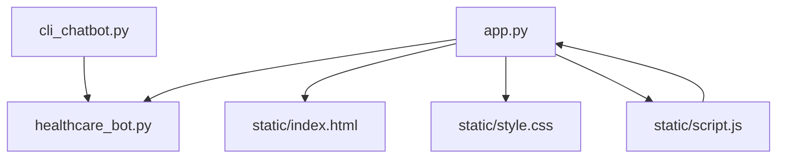
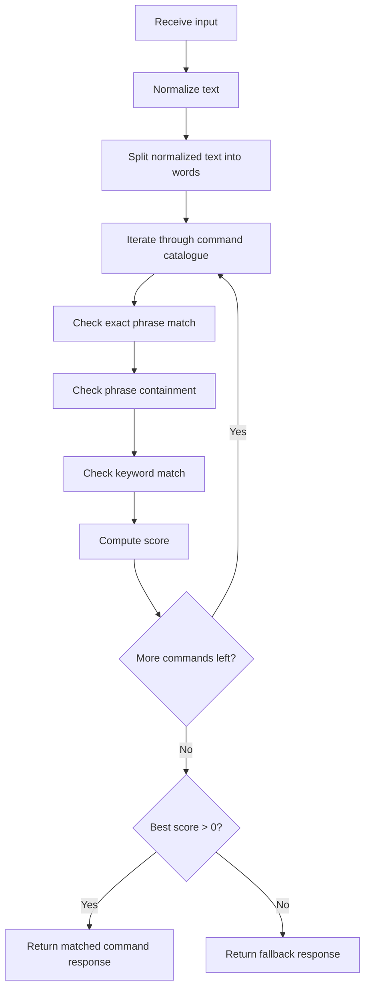
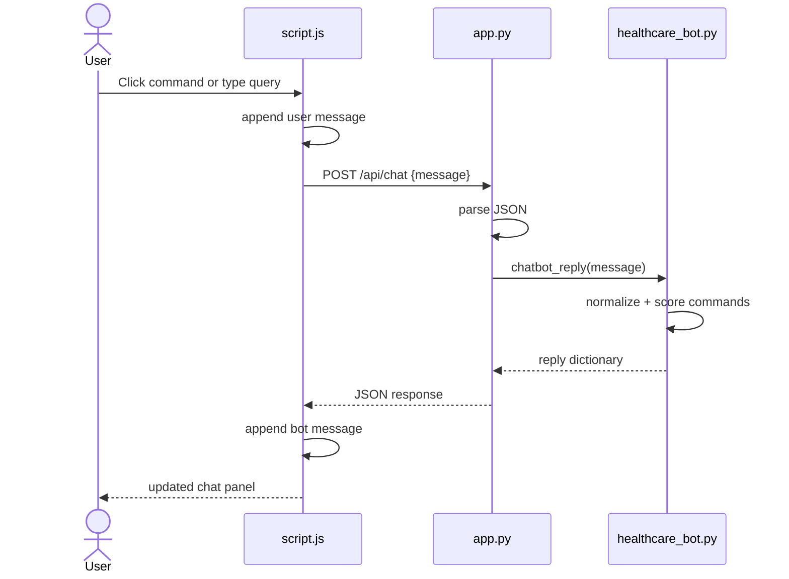
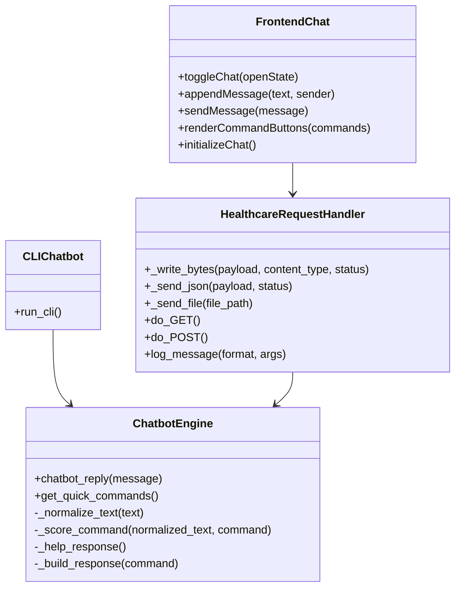
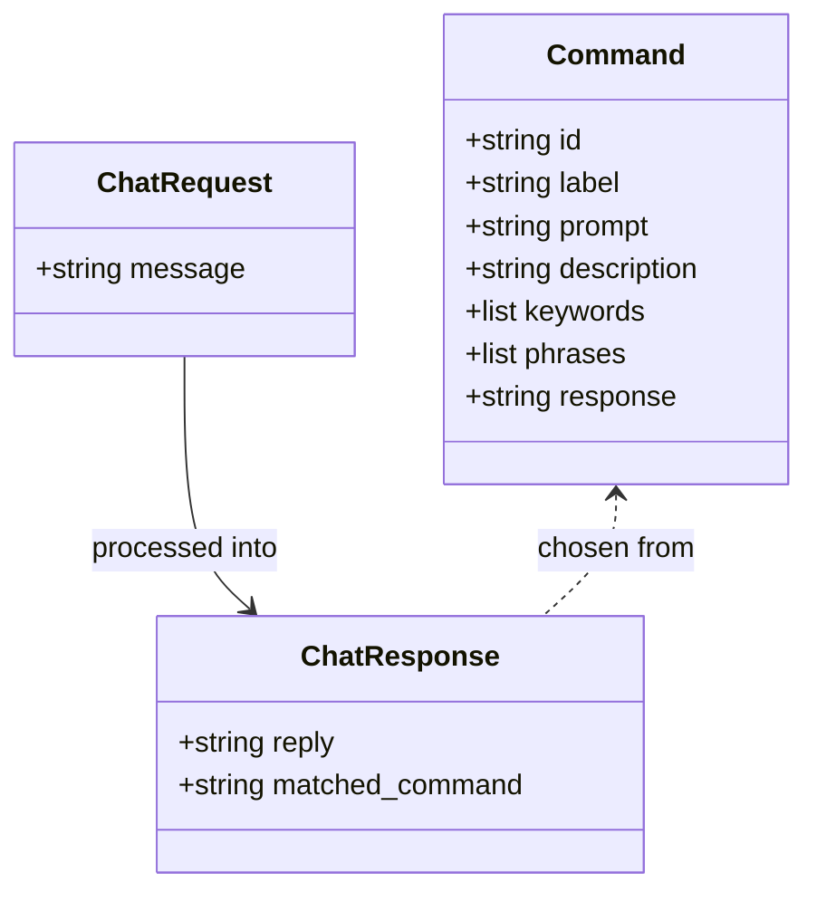
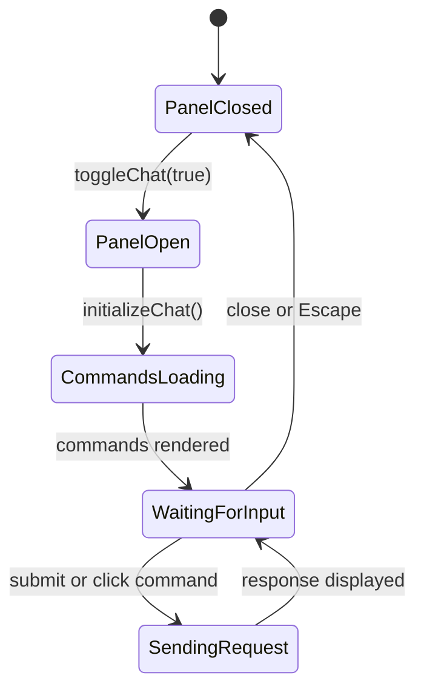

# Low Level Design
## Project: Design and Development of Natural Language Interface for Healthcare Infrastructure

## 1. Introduction

### 1.1. Scope of the document

This Low Level Design document describes the internal implementation details of the Healthcare Chatbot project, including module behavior, function responsibilities, detailed data structures, state handling, and API-level processing.

### 1.2. Intended Audience

This document is intended for:

- Developers implementing the project
- Reviewers checking the detailed design
- Testers validating module behavior
- Students preparing technical documentation

### 1.3. System overview

The system is implemented using:

- Python for the CLI, chatbot engine, and HTTP server
- HTML, CSS, and JavaScript for the web interface
- Basic keyword and phrase matching for natural language handling

The low-level design focuses on how each file and function works internally.

## 2. System Design

### 2.1. Application Design

The detailed module structure is:

- `healthcare_bot.py`
  - Stores chatbot constants and command definitions
  - Normalizes input text
  - Scores commands
  - Selects the best-matching response
- `cli_chatbot.py`
  - Starts the terminal chatbot loop
  - Detects exit conditions
  - Prints bot replies
- `app.py`
  - Defines request handler class
  - Serves HTML and static files
  - Provides JSON APIs
- `static/index.html`
  - Defines website sections and chatbot container
- `static/style.css`
  - Defines visual layout and responsive behavior
- `static/script.js`
  - Loads commands
  - Handles button clicks and typed input
  - Sends requests using Fetch API
  - Renders responses

### Low Level Module Diagram



### 2.2. Process Flow

Detailed processing inside the chatbot engine is:

1. Receive raw query text
2. Convert to lowercase
3. Remove punctuation and extra spaces
4. Compare input against configured phrases
5. Compare input against configured keywords
6. Score all commands
7. Select the highest-scoring command
8. Return the response or fallback message

### Detailed Matching Flowchart



### 2.3. Information Flow

Detailed website flow:

1. Browser loads `index.html`
2. Browser requests `style.css` and `script.js`
3. `script.js` calls `/api/commands`
4. Command buttons are rendered
5. User types a query or clicks a command button
6. `script.js` sends `POST /api/chat`
7. `app.py` parses JSON body
8. `chatbot_reply()` processes the message
9. Response JSON is returned
10. `script.js` appends the bot message to the chat panel

### Detailed Sequence Diagram for Web Chat



### 2.4. Components Design

#### `healthcare_bot.py`

Important internal elements:

- `PROJECT_NAME`
- `WELCOME_MESSAGE`
- `FALLBACK_MESSAGE`
- `COMMANDS`
- `EXIT_KEYWORDS`
- `GREETING_KEYWORDS`
- `THANKS_KEYWORDS`

Important functions:

- `_normalize_text(text)`
- `_score_command(normalized_text, command)`
- `_help_response()`
- `_build_response(command)`
- `get_quick_commands()`
- `chatbot_reply(message)`

#### `cli_chatbot.py`

Important internal behavior:

- Prints project heading
- Displays sample commands
- Runs infinite input loop
- Breaks when input matches exit keywords
- Calls `chatbot_reply()`

#### `app.py`

Important internal elements:

- `BASE_DIR`
- `STATIC_DIR`
- `HealthcareRequestHandler`
- `run_server(host, port)`
- `main()`

Important request handler methods:

- `_write_bytes()`
- `_send_json()`
- `_send_file()`
- `do_GET()`
- `do_POST()`
- `log_message()`

#### `static/script.js`

Important frontend functions:

- `toggleChat(openState)`
- `appendMessage(text, sender)`
- `sendMessage(message)`
- `renderCommandButtons(commands)`
- `initializeChat()`

### Low Level Component Relationship Diagram



### 2.5. Key Design Considerations

- The matching algorithm favors exact phrase matches over partial matches.
- Multi-word phrases receive higher relevance than isolated substrings.
- The API returns lightweight JSON for easier frontend integration.
- Frontend command buttons reduce typing effort and improve usability.
- The server is intentionally simple and uses only standard library modules.

### 2.6. API Catalogue

#### GET `/api/commands`

Purpose:

- Fetch welcome text and command button metadata

Response structure:

```json
{
  "project": "Nunnu HealthCare Center",
  "welcome": "Hello, I am the Healthcare Infrastructure Assistant...",
  "commands": [
    {
      "label": "Help",
      "prompt": "Help",
      "description": "Show the main commands supported by the assistant."
    }
  ]
}
```

#### POST `/api/chat`

Request:

```json
{
  "message": "Show status"
}
```

Response:

```json
{
  "reply": "Current demo status: Emergency is active 24/7, OPD is open from 8:00 AM to 8:00 PM, 12 general beds are available, 3 ICU beds are available, and the pharmacy is open.",
  "matched_command": "Show Status"
}
```

#### Internal API Mapping

| Trigger | Internal Call | Result |
|---|---|---|
| CLI text input | `chatbot_reply(message)` | Text response |
| GET `/api/commands` | `get_quick_commands()` | Command list JSON |
| POST `/api/chat` | `chatbot_reply(message)` | Reply JSON |

## 3. Data Design

### 3.1. Data Model

The main runtime data structure is the `COMMANDS` list. Each command is represented as a dictionary.

Fields:

- `id`
- `label`
- `prompt`
- `description`
- `keywords`
- `phrases`
- `response`

### Detailed Data Model Diagram



### 3.2. Data Access Mechanism

Detailed access methods used by the implementation:

- In-process function calls for chatbot logic
- Python list traversal for command lookup
- `Path.read_bytes()` for static file loading
- JSON decode and encode for API communication
- DOM manipulation for frontend chat rendering

### 3.3. Data Retention Policies

Detailed runtime retention behavior:

- The `COMMANDS` list stays loaded while the process is active
- Browser-rendered chat bubbles remain until the page is refreshed
- CLI conversation text remains on screen until the terminal is cleared or closed
- The backend does not write messages to files or a database

### 3.4. Data Migration

Potential future low-level migration changes:

- Replace hardcoded command dictionaries with JSON configuration
- Add loader functions for external command files
- Introduce SQLite or MySQL schema for commands and chat history
- Add migration utilities for importing command sets

## 4. Interfaces

### CLI Interface

Input:

- Plain terminal text

Output:

- Plain terminal response text

### Web Interface

Input:

- Chat text box
- Clickable command buttons
- Open and close chat controls

Output:

- User and bot messages rendered in message bubbles

### API Interface

Input format:

- JSON request body for chat

Output format:

- JSON response body

## 5. State and Session Management

Detailed state handling:

- `introLoaded` in `script.js` ensures welcome messages are not inserted repeatedly
- Chat panel open state is tracked through CSS class `open`
- `aria-hidden` and `aria-expanded` reflect current panel state
- No backend session identifier is created
- Each request is independent and stateless

### Detailed State Diagram



## 6. Caching

At implementation level:

- No dedicated cache object is used
- Command data works as natural in-memory cached configuration
- Browser may cache CSS and JS files
- API responses are recomputed on each request

## 7. Non-Functional Requirements

### 7.1. Security Aspects

Detailed security controls in the current implementation:

- Invalid JSON is rejected
- Unknown routes return controlled responses
- The server does not execute user-provided commands
- There is no persistent medical data exposure

Recommended low-level improvements:

- Limit maximum request size
- Add HTTP security headers
- Add rate limiting
- Add deployment behind HTTPS

### 7.2. Performance Aspects

Detailed implementation performance notes:

- Phrase and keyword matching is linear over the command list
- Command count is small, so latency stays low
- Static files are served directly from disk
- `ThreadingHTTPServer` allows basic parallel request handling

## 8. References

- `healthcare_bot.py`
- `cli_chatbot.py`
- `app.py`
- `static/index.html`
- `static/style.css`
- `static/script.js`
- Python standard library modules:
  - `http.server`
  - `json`
  - `pathlib`
  - `re`
  - `argparse`
